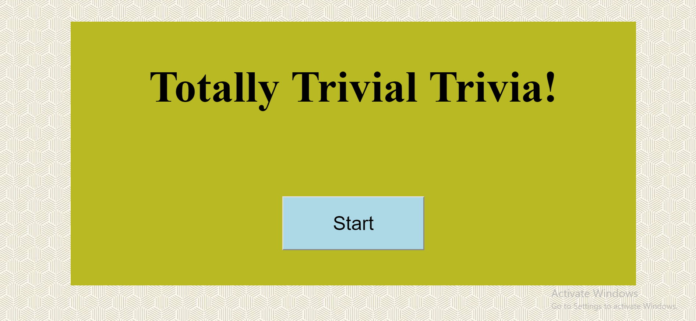
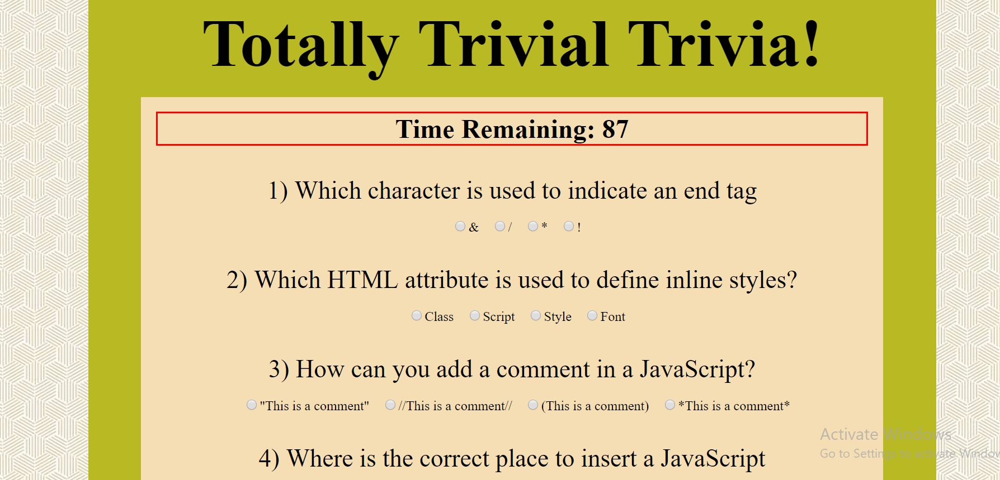
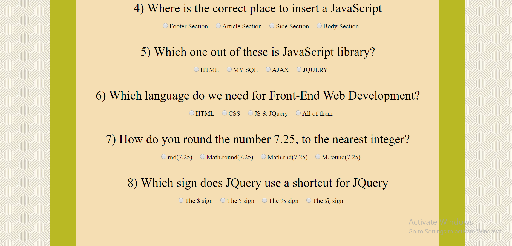
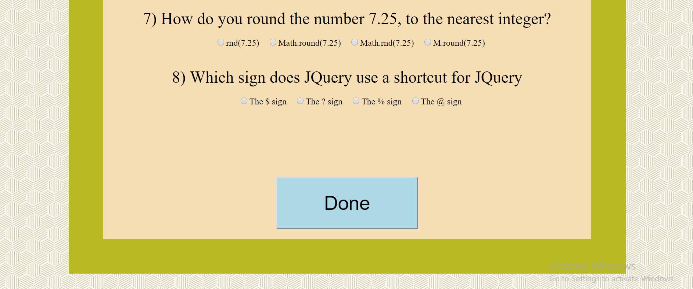
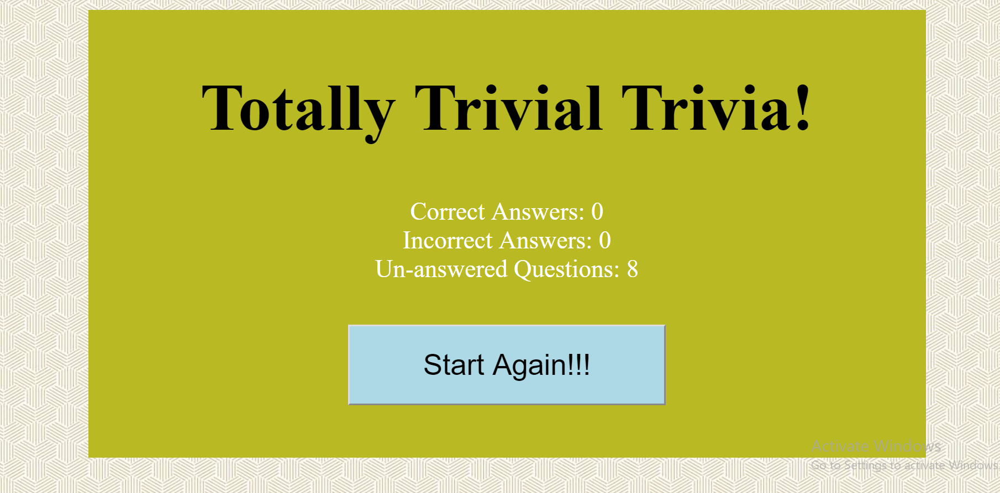

**
📘 Trivial Trivia 📘 
**

  
**Instructions:**

- The player will have a limited amount of time to finish the quiz.

- The quiz ends when the time runs out or player click done button. Then, it reveals the number of questions that players answer correctly, incorrectly, and didn't answer.

- The player can only pick one answer per question.

 

 

**Screenshots**

  

  

  

  

 

**Built With**

- HTML 5
- CSS 3
- Javascript

 

**Images By**

Maneet Singh - https://github.com/Maneet79

 

**Author**

Maneet Singh - https://github.com/Maneet79

 

**License**

This project is licensed under the MIT License - see the https://github.com/Maneet79 file for details
